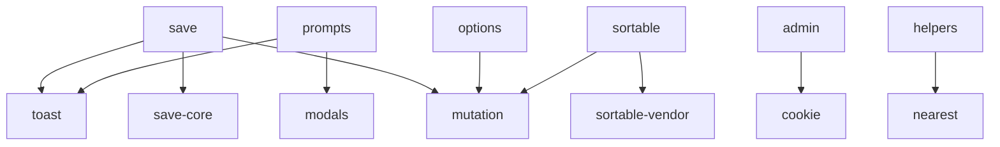

# HyperclayJS

A modular JavaScript library for building interactive HTML applications with Hyperclay.

## Features

- 🎯 **Modular Design** - Load only what you need
- 🚀 **Self-detecting Script** - Automatic dependency resolution
- 📦 **Tree-shakeable** - Optimized for modern bundlers
- 🎨 **Rich Feature Set** - From basic save to advanced UI components
- 💪 **Zero Dependencies** - Core modules have no external dependencies

## Quick Start

### Using CDN (Self-detecting)

```html
<!-- Minimal setup (23KB) -->
<script src="https://cdn.hyperclay.com/js/hyperclay-starter-kit.js?features=save,admin,toast" type="module"></script>

<!-- Standard setup (50KB) -->
<script src="https://cdn.hyperclay.com/js/hyperclay-starter-kit.js?preset=standard" type="module"></script>

<!-- Everything (220KB) -->
<script src="https://cdn.hyperclay.com/js/hyperclay-starter-kit.js?preset=everything" type="module"></script>
```

### Using NPM

```bash
npm install hyperclayjs
```

```javascript
// Import only what you need
import { savePage, toast } from 'hyperclayjs';

// Or use the preset bundles
import 'hyperclayjs/presets/standard';
```

## Available Modules

### Core Features

| Module | Size | Description |
|--------|------|-------------|
| `save-core` | 3KB | Basic save functionality |
| `save` | 3KB | Full save system with auto-save |
| `admin` | 10KB | Admin/viewer differentiation |
| `persist` | 1.4KB | Form value persistence |
| `options` | 4.4KB | Dynamic visibility rules |

### UI Components

| Module | Size | Description |
|--------|------|-------------|
| `toast` | 7.3KB | Toast notifications |
| `modals` | 18.8KB | Modal system |
| `prompts` | 7.5KB | Dialog functions (ask, consent, tell) |

### Custom Attributes

| Module | Size | Description |
|--------|------|-------------|
| `events` | 2.7KB | Custom event attributes |
| `ajax` | 1.8KB | AJAX form/button elements |
| `sortable` | 118KB | Drag-drop sorting |
| `helpers` | 5.3KB | DOM helper methods |
| `inputs` | 1KB | Input enhancements |

### Development Tools

| Module | Size | Description |
|--------|------|-------------|
| `tailwind-play` | 29KB | Live Tailwind CSS editing |

## Presets

### Minimal (23KB)
- Save system
- Admin features
- Toast notifications

### Standard (50KB)
- Everything in Minimal
- Form persistence
- AJAX elements
- Event attributes
- DOM helpers

### Everything (220KB)
- All available features
- Including Sortable.js
- Modal system
- Development tools

## Module Dependencies



## Configuration

### Custom Builds

Create your own preset by specifying features:

```javascript
// hyperclay.config.js
export default {
  features: ['save', 'admin', 'toast', 'ajax'],
  // Dependencies are auto-resolved
};
```

### Dynamic Loading

Load features dynamically based on conditions:

```javascript
// Only load sortable when needed
if (document.querySelector('[sortable]')) {
  await import('hyperclayjs/features/sortable');
}
```

## Browser Support

- Chrome 90+
- Firefox 88+
- Safari 14+
- Edge 90+

All features use modern JavaScript (ES2020+). For older browser support, use a transpiler.

## Development

### Project Structure

```
hyperclayjs/
├── core/           # Core dependencies
├── features/       # Feature modules
├── ui/            # UI components
├── dom/           # DOM utilities
├── browser/       # Browser utilities
├── vendor/        # Third-party libraries
├── dist/          # Built bundles
└── presets/       # Preset configurations
```

### Building

```bash
# Install dependencies
npm install

# Build all modules
npm run build

# Watch mode
npm run dev

# Run tests
npm test
```

### Creating a Module

Modules should be self-contained ES modules:

```javascript
// features/my-feature.js
import { dependency } from '../core/dependency.js';

export function myFeature() {
  // Feature implementation
}

// Auto-initialize if needed
if (typeof window !== 'undefined') {
  myFeature();
}
```

## API Documentation

See [API.md](./API.md) for detailed documentation of all modules.

## Migration Guide

### From Monolithic Script

Before:
```html
<script src="/js/hyperclay.js"></script>
```

After:
```html
<script src="/js/hyperclay-starter-kit.js?preset=standard" type="module"></script>
```

### From Individual Imports

Before:
```javascript
import { hyperclay } from './hyperclay.js';
hyperclay.savePage();
```

After:
```javascript
import { savePage } from 'hyperclayjs/features/save';
savePage();
```

## Contributing

See [CONTRIBUTING.md](./CONTRIBUTING.md) for guidelines.

## License

MIT © Hyperclay

## Changelog

See [CHANGELOG.md](./CHANGELOG.md) for release history.